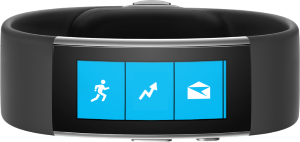
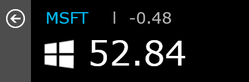

## Microsoft Band Web Tile stock ticker

A tile for the Microsoft Band that shows stock quotes
for MSFT, APPL, GOOG, YHOO and FB.

### Download
Any Web Tile for the Microsoft Band is a zip file with the
file extension **.webtile**. Simply download the file on
a phone that has the Microsoft Health app installed
and it will be added to your Band.

[Download the latest build](https://ci.appveyor.com/project/madskristensen/stocktickerwebtile/build/artifacts)
from your phone now.

### Fork the project
A web tile is just a JSON file and images. This project
was built in Visual Studio which gives a few extra benefits,
such as automatic compilation into a **.webtile** file.

To automatically generate the **.webtile** file on build,
download the
[Command Task Runner extension](https://visualstudiogallery.msdn.microsoft.com/e6bf6a3d-7411-4494-8a1e-28c1a8c4ce99)
for Visual Studio 2015 and now compilation happens when
the project is built in Visual Studio.